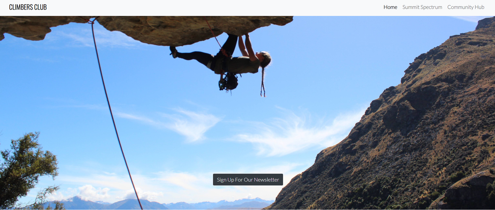
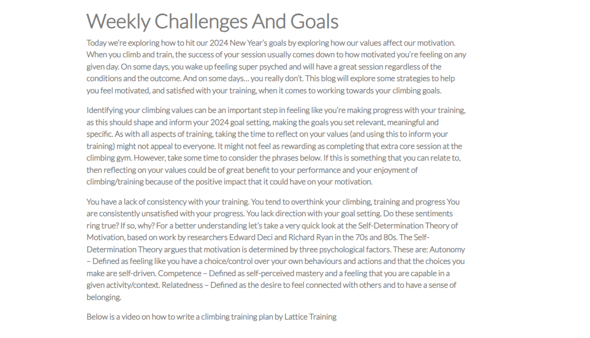

# Climbers-Club

Visit the website [here](https://climbers-club-se9p.vercel.app
)

Climbers-Club is a website created to provide guidance and inspiration for climbers, particularly those interested in rock climbing outdoors. This project was developed for educational purposes only.

## Website Sections

1. **Home/Introduction & Newsletter Signup:**
   - A welcoming introduction image to the website and the sections below provide direction for the user.

   - Users can sign up for Climbers-Club's newsletter for future updates and content.
\](<docs/newsletter and home screen.png>)](docs/newsletter-and-home-screen.png)

2. **Summit Spectrum:**
   - Section filled with valuable tips for climbing and also background stories and news within the climbing world.
](docs/summit-spec-goals.png)
3. **Community Hub:**
    - Users can sign up to be part of the community. (int eh future this would send them a link to log into a fully developed members area)
  ](docs/communityhub-form.png)

## Business Goals

1. Advise users on climbing and updates within the climbing world.
2. Inspire users to get the most out of climbing and maybe go on bigger climbing trips.
3. In the future i'd like to interrgrate a E-Commerce store and sell items to users from the website
4. Build a database of users for future communication.

## User Goals

1. Easily find useful information and tips for climbing.
2. Access a helpful guide on climbing training and goal setting.
3. Link to to other trusted pages for more information.
4. Sign up for the newsletter to receive direct content.

## UX Strategy

- Target Users: Aged 16-65+, past/future climbers, and those interested in climbing.
- User Expectations: Clear, concise, and easy-to-find information with beautiful, inspiring visuals.

## Scope

To achieve the desired user and business goals, the website includes features such as:
- Responsive header and menu bar.
- Detailed guide to training and linking to further videos to gain more knowledge.
- Community sign up form.
- Newsletter sign-up form.

## Structure

The website follows a single-page structure with the following order:
1. Home (Newsletter Signup)

](docs/homepage-screenshot2.png)
2. Summit Spectrum
](docs/summitspec-1.png)
](docs/summitspec-2.png)

3. Community Hub (Community Signup form)
](docs/communityhub-full-sc.png)

## Surface

- Fonts: 'Lato', 'Oswald'
- Fully responsive design for optimal viewing on various devices.

## Technologies Used

- HTML, CSS, JavaScript (for responsive features).
- Google Fonts for 'Lato' and 'Oswald'.
- Font Awesome for social media icons.
- Various tools for development, validation, and testing i.e.: Vercel (for deployment)

## Features

- Fully responsive design, mobile-first approach.
- Navbar with a collapsible menu for smaller screens.
- Visually appealing sections with consistent fonts and colors.
- Interactive elements like image overlays with 'find out more' text over them

## Testing

- HTML and CSS validated with no errors.

## Deployment

The Climbers Club website is deployed using [Vercel](https://vercel.com/) with seamless integration with the GitHub repository. Follow the steps below to deploy the website:

### Vercel Deployment Steps:

1. **Login to Vercel:**
   - Log in to your Vercel account or sign up if you don't have an account.

2. **Create a New Project:**
   - Click on the "Create" button to start a new project.

3. **Connect GitHub Repository:**
   - Choose the "Import Git Repository" option.
   - Select your Climbers Club GitHub repository.

4. **Configure Project Settings:**
   - Configure your project settings, including the branch you want to deploy (usually the main/master branch).

5. **Build Settings:**
   - Vercel will automatically detect the type of project (Next.js, React, etc.).
   - Ensure the build settings are appropriate for your project.

6. **Environment Variables:**
   - If your project requires environment variables, add them in the Vercel dashboard.

7. **Deploy:**
   - Click on the "Deploy" button to start the deployment process.

8. **View Deployment:**
   - Once the deployment is successful, Vercel will provide you with a unique URL for your deployed Climbers Club website.

### Automatic Deployment:

With Vercel's GitHub integration, every push to the configured branch on GitHub triggers an automatic deployment. This ensures that your deployed website stays up-to-date with the latest changes in the GitHub repository.

### Manual Redeployment:

If needed, you can manually trigger a redeployment on Vercel:
   - In the Vercel dashboard, go to your project.
   - Click on the "Deployments" tab.
   - Click on the "Redeploy" button for the specific deployment you want to update.

Now, your Climbers Club website is live and can be accessed through the provided Vercel URL.

Feel free to check the [Vercel Documentation](https://vercel.com/docs) for more detailed information on deploying and managing projects.

## Acknowledgements

Special thanks to course mentor Harry Dhillon for his support and feedback.

---
